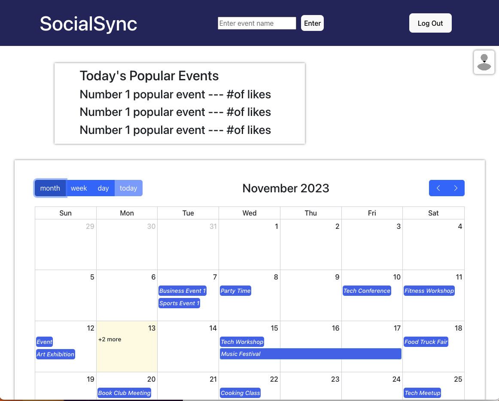
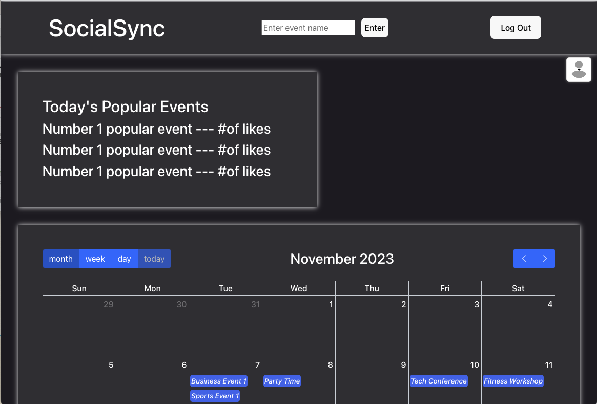
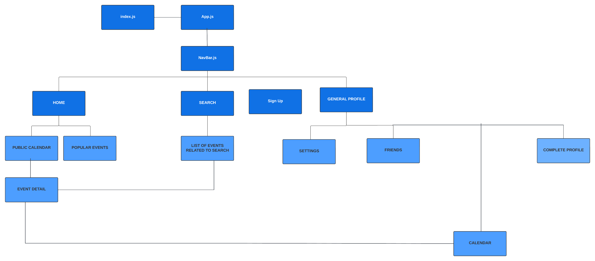
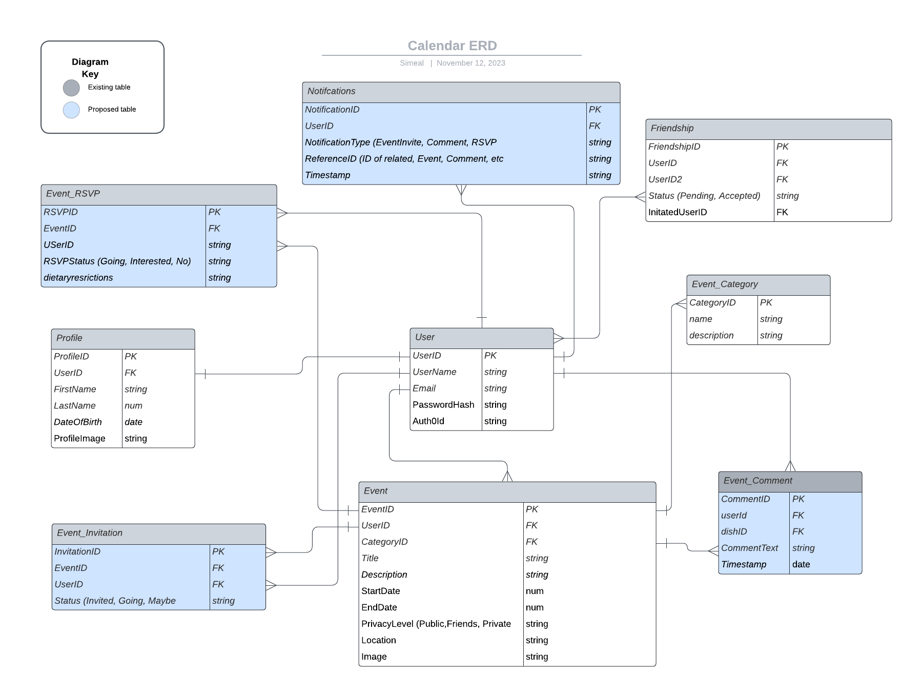

# SocialSync - Your Personal Event Calendar

Welcome to SocialSync, a full-stack social media application optimized for web view first. SocialSync allows users to create profiles, access multiple types of calendars (public, friends, and personal), and discover events in their area. With SocialSync, you can easily manage and interact with events through a user-friendly interface.


<div style="display: flex; justify-content: space-around;">
    
    
</div>

## Features

- **User Profiles:** Create and customize your user profile with personal information and preferences.
- **Calendars:** Access a calendar: Public, Friends, and Personal, each with it's own set of events.
- **Event Discovery:** Explore and discover various events in your local area or beyond.
- **Event Management:** Create, edit, and delete events with full CRUD capabilities directly from your calendar. Full CRUD exists on the backend across the event and user schemas.
- **Social Features:** Connect with friends, and populate your calendar with their events for easy event tracking and interaction.

## Component Hierarchy Diagram



## Entity-Relationship Diagram (ERD)



## Installation Guide

1. Download the project from GitHub:
   - Navigate to the project via the URL.
   - In the GitHub code tab, click on the green "Code" button located on the right of the screen.
   - Copy the HTTP or SSH or GitHub CLI URL.
   - In your local terminal, type the following commands:
     git clone {the URL you just copied}
    Example:
    ```
    git clone https://github.com/theL-A-W/Project3.git
    ```
   - Press Enter.
   2. If you wish to connect your own MongoDB Atlas database:

   a. Navigate to the `db` directory:
      ```
      cd Project3/SocialSync_Back-End/db
      ```

   b. Open the `index.js` file:
      ```
      nano index.js
      ```

   c. Locate the `.connect` function in the file and replace the connection string with your MongoDB Atlas connection string.

   Example:
   ```javascript
   mongoose
       .connect('your_mongodb_atlas_connection_string_here')
       .then(() => {
           console.log('Successfully connected to MongoDB.')
       })
       .catch(e => {
           console.error('Connection error', e.message)
       })
    ```
d. Save the changes and exit the editor.

e. Run the backend server again:
npm run dev

Your backend will now be connected to the specified MongoDB Atlas database. Make sure to replace 'your_mongodb_atlas_connection_string_here' with the actual connection string provided by MongoDB Atlas.

For more information, please visit the Atlas Documentation: https://www.mongodb.com/docs/atlas/mongodb-for-vscode/

This section provides instructions for users who want to connect their own MongoDB Atlas database by updating the connection string in the `index.js` file. Adjust the instructions based on the specifics of your project and MongoDB Atlas configuration.

3. Setting up Auth0

    a. Create an Auth0 Account:

    - If you don't have an Auth0 account, sign up at Auth0.
    - Create a New Application:

    b. Once logged in, go to the Auth0 Dashboard.
        - Click on "Create Application."
        - Choose a name for your application, select the application type (Single Page Web Applications for React), and click "Create."
        - Get Auth0 Credentials:

    c. In your Auth0 application settings, note down the following:
    ```
    Domain (YOUR_AUTH0_DOMAIN)
    Client ID (YOUR_CLIENT_ID)
    Configure Callback URLs:
    ```

    d. In your Auth0 application settings, configure the Allowed Callback URLs. For a local development server, you might use http://localhost:5173/callback.
    - Create Configuration File
    - Create a .env file:

    e. In the root directory of your project, create a file named .env.
    - Add Auth0 and MongoDB Atlas Configurations:

    Open the .env file and add the following configurations:
    ```
    MONGODB_URI=your_mongodb_atlas_connection_string_here
    SECRET=your_secret_key_here
    CLIENT_ID=your_auth0_client_id_here
    ISSUER_BASE_URL=your_auth0_domain_here
    Replace the placeholder values with the actual values you obtained from the Auth0 and MongoDB Atlas setups.
    ```

4. Navigate to the appropriate directory:
    ```
    cd Project3/SocialSync
    ```
   - Install dependencies in package.json using the following command:
    ```
    npm install
    ```
    Or, if you encounter errors:
    ```
    sudo npm install
    ```
    (Remember, no quotations!)

5. Run the application in your local server:
    ```
    npm run dev
    ```
    Or, if you encounter errors:
    ```
    sudo npm run dev
    ```

6. Copy the local host URL and paste it in the browser address bar. Example: `http://localhost:5173/`


Ensure that both the frontend (Vite) and backend (Node.js with Express) servers are running simultaneously.

7. Once both servers are running, you can access the public calendar and explore other functionalities by navigating to the provided localhost URL in your web browser. Example: `http://localhost:5173/`

8. To view the public calendar, sign in, or sign up as a user, you can interact with the application and enjoy its full functionality.

Remember to check the console or terminal for any error messages during the installation and running processes. Adjustments may be needed based on your system configuration or environment. If you encounter any issues, feel free to refer to the project documentation or seek assistance from contributors. 

## Cool Features and Successes

- Full planning, including collaborative wireframes, CHD (Component Hierarchy Diagram), ERD (Entity-Relationship Diagram) and Trello board.

- CHD was used to visually facilitate pseudo code and design assumptions.

- Successful implementation of a search bar that displays events in nicely styled cards.

- Use of Trello for collaboration and task assignment.

- useContext used for state management.

- Query-free navigation with useStates/useContext instead of param-based routes.

- onClick anonymous functions to build functionality into button clicks.

- Search results mapping.

- Light and Dark mode.

## Challenges

During the development of SocialSync, the team encountered several challenges that required innovative solutions and persistent problem-solving. These challenges encompassed various aspects of the application:

Auth0 Integration: Integrating Auth0 for secure authentication posed challenges, demanding a thorough understanding of the platform and its interaction with the application.

Backend Verification with Auth0: Establishing a seamless connection between Auth0 and the backend for user verification proved to be a complex task, requiring careful consideration of authentication flows.

User Verification Middleware: Implementing middleware for initial user verification, bridging the gap between Auth0 and the backend User model, presented a unique set of challenges.

Data Seeding for Backend: Seeding data for the backend database required meticulous planning and execution to ensure the availability of realistic data for testing and development.

Friendship Management: Developing functionality for accepting pending friend requests, making friend requests, and managing the overall friendship system presented challenges in user interaction and data handling.

FullCalendar.io Integration: Integrating and optimizing FullCalendar.io, a JavaScript event calendar library, posed challenges in ensuring seamless functionality and a smooth user experience.

Searchbar Implementation: The implementation of a search bar with dynamic and responsive results required careful consideration of user input and effective mapping of search results.

Bug Fixes: Addressing and resolving various bugs throughout the development process required a systematic approach to debugging and troubleshooting.

These challenges not only tested the technical skills of the development team but also provided valuable learning opportunities and insights into overcoming complex issues in a collaborative environment. Each challenge contributed to the overall growth and expertise of the team, enhancing the quality of SocialSync.


## What We'd Do Differently Next Time
The development of SocialSync was a valuable learning experience, and reflecting on the process opens opportunities for improvement in future projects. Here are some key takeaways and considerations for our next endeavor:

Enhanced Planning: While our planning process was robust, there is always room for improvement. In the future, we would focus on even more detailed planning to anticipate potential challenges and streamline the development process.

Documentation: Comprehensive documentation is crucial for project understanding and maintenance. In the future, we'll place an even greater emphasis on maintaining up-to-date documentation to facilitate collaboration and onboarding.

Alternate Technologies: Exploring alternative technologies or frameworks might offer valuable insights and efficiencies. Next time, we'll consider experimenting with different technologies to find the best fit for the project requirements.

## Stretch Goals

As we continue to evolve SocialSync, we have identified several exciting stretch goals that would further enhance the user experience and functionality of the application. These goals include:

Liked Event: Implement a feature where users can express their interest or "like" specific events, providing a more dynamic and engaging interaction with the content.

Popular Events: Explore the integration of a popularity metric for events, allowing users to discover trending or highly-rated activities within the community.

Google Maps Integration: Utilize the Google Maps API to seamlessly link event locations with directions. This enhancement would provide users with a convenient way to navigate to events directly from the application.

Event Attendee List: Enable users to view a list of attendees when they click on an event, fostering a sense of community engagement and connection.

Search by Date in Calendar: Implement a search functionality within the calendar, allowing users to easily locate and explore events based on specific dates.

These stretch goals not only add exciting features but also contribute to making SocialSync a comprehensive and user-centric platform for event management and social interaction. As we work towards these goals, we look forward to the continued growth and improvement of our application.

## Current Bugs 

1. Initial open event details flicker.
2. Needing to refresh the page when deleting an event (windows.location.reload() is the current band-aid).
3. Creating privacy level and category to stay on display when selected.
4. Creating an event needs to render the event dynamically on the calendar without needing to refresh (windows.location.reload() is the current band-aid).
5. Friends request: Users can request their own email as a friend.
6. Having public and private events filtered to the appropriate calendar.
7. "Welcome User" should update the user's profile name.
8. Dark Mode automatically turns on when going back to settings.


## Contributors

**Anthony Lynch**

**Simeal Woldu**

**Lindsay Walker**

## Reflections

SocialSync, a web view-first social media application, reflects a collaborative effort that incorporates various technologies and methodologies. Throughout the development process, the team gained insights into effective project planning through wireframes, Entity-Relationship Diagram (ERD) and Component Hierarchy Diagrams (CHD), driving functionality discussions and visualizing design assumptions. Noteworthy successes include the implementation of a user-friendly search bar, demonstrating the team's ability to seamlessly integrate frontend features. The use of useContext for state management and the adoption of query-free navigation further showcase the team's proficiency in React. The challenges faced, such as the tendency to overcomplicate tasks, contribute to valuable learning experiences, emphasizing the importance of simplicity in development.

## Acknowledgments

- General Assembly Staff: Gratitude to the instructors and support staff at General Assembly for their guidance and assistance.
  
- Bootstrap Documentation: Thanks to the Bootstrap team for providing comprehensive documentation and tools for frontend development.
  
- ChatGPT: Appreciation for the capabilities and assistance provided by the ChatGPT language model from OpenAI.

- Stack Overflow: Recognition to the vibrant community on Stack Overflow for their invaluable contributions and problem-solving discussions.

- GitHub: Thanks to GitHub and its community for fostering collaboration, version control, and open-source development.

- Workforce Opportunity Services: Acknowledgment to Workforce Opportunity Services for providing opportunities and support for workforce development.

- Atlas MongoDB:  https://www.mongodb.com/atlas/database

- Atlas MongoDB Connect via VS Code Documentation:  https://www.mongodb.com/docs/atlas/mongodb-for-vscode/

- Auth0 Documentation: https://auth0.com/docs/quickstart/spa/react

- Full Calendar Documentation: https://fullcalendar.io/

- React Bootstrap Documentation: https://react-bootstrap.netlify.app/

## Programming Languages/Technologies

**MongoDB:** A NoSQL database for storing user data, calendars, and events.
  
**Express.js:** A web application framework for building robust APIs.
  
**React:** A JavaScript library for building a dynamic and interactive user interface.
  
**Node.js:** A server-side runtime environment for executing JavaScript.
  
**Web View Optimization:** The application is designed with a web view-first approach for a seamless user experience.

**Vite:** The tooling used for frontend development.
  
**Auth0:** Authentication and authorization platform.
  
**Bootstrap:** Front-end framework for designing responsive and mobile-first applications.
  
**FontAwesome:** Icon set and toolkit for web development.
  
**FullCalendar:** JavaScript event calendar library.
  
**Axios:** Promise-based HTTP client for the browser and Node.js.
  
**Mongoose:** MongoDB object modeling for Node.js.

---


